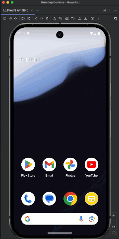
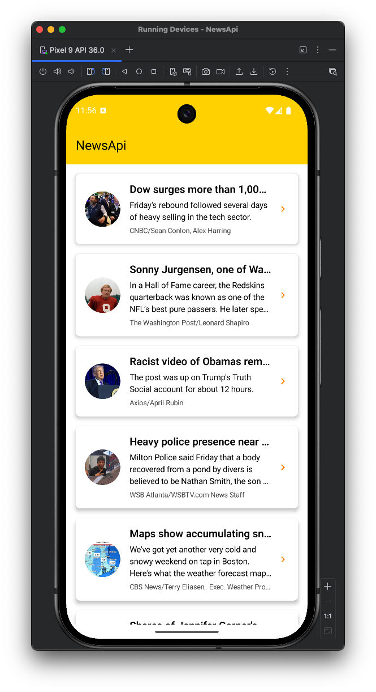
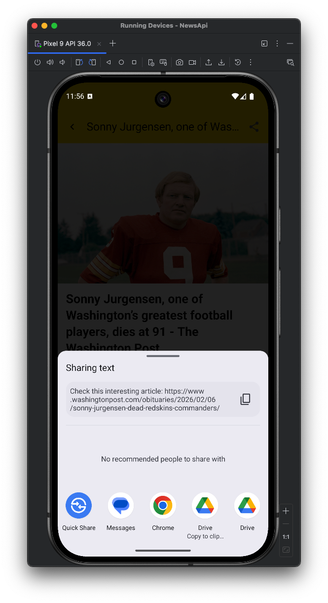

# NewsApi

A modern Android news reader application that fetches and displays the latest headlines
from [NewsAPI.org](https://newsapi.org).

## Features

- **Browse Latest Headlines** - View a curated list of recent news articles
- **Article Details** - Read article summaries with images, source info, and publication dates
- **Full Article Access** - Open complete articles on the publisher's website
- **Pull-to-Refresh** - Manually refresh news feed with a swipe gesture
- **Share Articles** - Easily share article links with others

## Architecture

The application follows a **multi-module Clean Architecture** pattern, which is a best practice for
modern Android development:

### Module Structure

```
app/                          - Main application module
core/
  common/                     - Shared utilities and base classes
  network/                    - Retrofit + Kotlinx Serialization for API communication
  database/                   - Room persistence layer
  ui/                         - Compose design system (theme, colors, widgets)
feature/
  news/
    domain/                   - Business logic: entities, repository interfaces, use cases
    data/                     - Data implementation: repositories, data sources, cache
    presentation/             - UI layer: Compose screens, ViewModels, navigation
```

**Core Modules** provide reusable infrastructure:

- `core:network` - API client with error handling
- `core:database` - Room database for local caching
- `core:ui` - Design system (Material 3 theme, colors, reusable widgets)

**Feature Modules** aggregate functionality per feature domain, following **Clean Architecture**
principles within each feature:

- `presentation` - ViewModels, Compose screens, navigation
- `domain` - Business logic, use cases, entity definitions
- `data` - Repository implementations, data sources, caching

### Data Strategy

Due to API rate limits, the app implements a **same-day caching strategy**:

1. Articles are cached locally in Room database after fetching from the API
2. Cache is valid for one calendar day
3. Subsequent app loads within the same day serve cached content
4. This minimizes API calls while ensuring data freshness

## Current Limitations

- Fetches only the first page of headlines
- No category filtering
- No country-based filtering
- No pagination support

## Future Improvements

### API & Data Features

- **Enhanced API Features**: Add category and country filters and similar
- **Pagination**: Load articles in pages instead of just the first page
- **Infinite Scroll**: Automatically load more articles as user scrolls
- **Request-Specific Caching**: Cache responses per request parameters (not just one global list)
- **Pre-fetching**: Fetch next 2 (or more) pages in background to have data ready before user
  reaches the end

### Testing & Quality

- **UI Screenshot Tests**: Add screenshot testing for Compose components using Paparazzi
- **E2E Automation Tests**: Add automated tests covering critical business flows

## Building the Project

1. Clone the repository
2. Add your NewsAPI.org key to `local.properties`:
   ```properties
   news.api.key=your_api_key_here
   ```
3. Build the project:
   ```bash
   ./gradlew assembleDebug
   ```

## Code Quality

The project enforces code quality through automated checks:

```bash
# Format code
./gradlew spotlessApply

# Check formatting
./gradlew spotlessCheck

# Run static analysis
./gradlew detekt
```

## Screenshots

| | | | |
|:---:|:---:|:---:|:---:|
|  |  |  |  |
